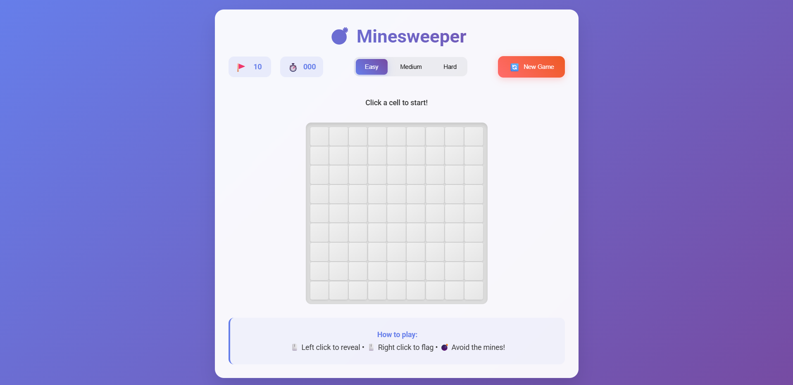

# 💣 Minesweeper Game

A beautiful, modern implementation of the classic Minesweeper game built with HTML, CSS, and JavaScript. Features a sleek gradient design, smooth animations, and responsive layout that works perfectly on both desktop and mobile devices.

## 📸 Screenshot



## 🎮 Features

### Core Gameplay
- **Classic Minesweeper mechanics** - Left-click to reveal, right-click to flag
- **Smart mine placement** - Mines are never placed on your first click
- **Auto-reveal** - Empty areas automatically expand when clicked
- **Win/Lose detection** - Proper game state management with celebrations

### Visual Design
- **Modern UI** - Beautiful gradient-based design with purple/blue theme
- **Smooth animations** - Hover effects, transitions, and interactive feedback
- **Responsive design** - Optimized for both desktop and mobile devices
- **Color-coded numbers** - Each number (1-8) has a distinct color for easy recognition

### Game Features
- **Three difficulty levels:**
  - **Easy:** 9×9 grid with 10 mines
  - **Medium:** 16×16 grid with 40 mines  
  - **Hard:** 16×30 grid with 99 mines
- **Real-time timer** - Starts counting when you make your first move
- **Flag counter** - Shows remaining flags available
- **Game status indicators** - Clear feedback on current game state
- **Restart functionality** - Quick restart with animated button

### Polish & UX
- **Animated interactions** - Pulse effects for flags, explosion animations for mines
- **Victory/Defeat modals** - Celebrate wins and review game statistics
- **Mobile-responsive** - Touch-friendly interface that adapts to screen size
- **Accessibility** - Clear visual feedback and intuitive controls

## 🚀 How to Play

### Getting Started
1. Open `index.html` in any modern web browser
2. Choose your preferred difficulty level (Easy, Medium, or Hard)
3. Click any cell to start the game - the timer begins with your first click!

### Game Controls
- **Left Click** - Reveal a cell
- **Right Click** - Place or remove a flag on a suspected mine
- **Goal** - Reveal all cells that don't contain mines

### Game Rules
1. **Numbers indicate nearby mines** - Each revealed number tells you how many mines are in the 8 adjacent cells
2. **Use logic to deduce mine locations** - Use the numbers to figure out where mines are hidden
3. **Flag suspected mines** - Right-click to mark cells you think contain mines
4. **Avoid the mines** - If you click on a mine, the game ends
5. **Win by revealing all safe cells** - You don't need to flag all mines, just reveal all non-mine cells

### Tips for Success
- **Start with corners and edges** - These have fewer neighbors, making them easier to analyze
- **Look for patterns** - Numbers next to revealed areas give you the most information
- **Use the flag counter** - Keep track of how many mines you've flagged vs. total mines
- **Take your time** - There's no penalty for thinking through your moves

## 🛠️ Technical Details

### Files Structure
```
minesweeper/
├── index.html      # Main game structure
├── styles.css      # Modern styling and animations
├── script.js       # Game logic and interactions
├── README.md       # This documentation
└── screenshot.png  # Game screenshot (add your own)
```

### Technologies Used
- **HTML5** - Semantic structure and accessibility
- **CSS3** - Modern styling with gradients, animations, and responsive design
- **Vanilla JavaScript** - Pure JavaScript with no dependencies
- **Google Fonts** - Roboto font family for clean typography

### Browser Compatibility
- ✅ Chrome 60+
- ✅ Firefox 55+
- ✅ Safari 12+
- ✅ Edge 79+
- ✅ Mobile browsers (iOS Safari, Chrome Mobile)

## 🎯 Game Difficulty Levels

| Difficulty | Grid Size | Mines | Best For |
|------------|-----------|-------|----------|
| **Easy** | 9×9 | 10 | Beginners, quick games |
| **Medium** | 16×16 | 40 | Intermediate players |
| **Hard** | 16×30 | 99 | Expert players, challenge seekers |

## 📱 Mobile Experience

The game is fully optimized for mobile devices with:
- Touch-friendly cell sizes
- Responsive grid layouts that adapt to screen size
- Optimized difficulty settings for mobile (Medium uses 12×12 grid on mobile)
- Gesture-based controls (tap to reveal, long-press to flag)

## 🎨 Customization

The game uses CSS custom properties, making it easy to customize colors and styling. Key design elements include:

- **Primary gradient:** `linear-gradient(135deg, #667eea 0%, #764ba2 100%)`
- **Accent colors:** Various shades for numbers, flags, and interactive elements
- **Animation timing:** Smooth 0.3s transitions throughout
- **Responsive breakpoints:** Mobile-first design with desktop enhancements

## 🤝 Contributing

Feel free to fork this project and submit pull requests for improvements! Some ideas for enhancements:

- **Sound effects** - Add audio feedback for clicks, flags, and game events
- **Themes** - Additional color schemes and visual themes
- **Statistics** - Track wins, losses, and best times
- **Multiplayer** - Add competitive or cooperative modes
- **Accessibility** - Enhanced keyboard navigation and screen reader support

## 📄 License

This project is open source and available under the MIT License. Feel free to use, modify, and distribute as you see fit.

---

**Enjoy playing Minesweeper!** 🎉

*If you encounter any issues or have suggestions for improvements, feel free to open an issue or submit a pull request.*
